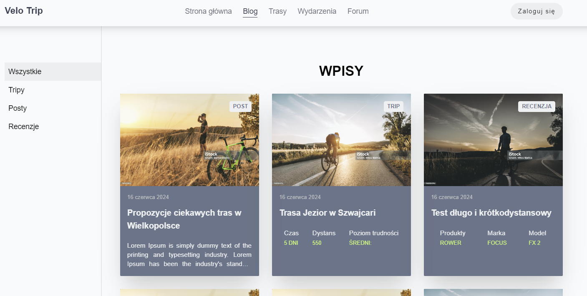
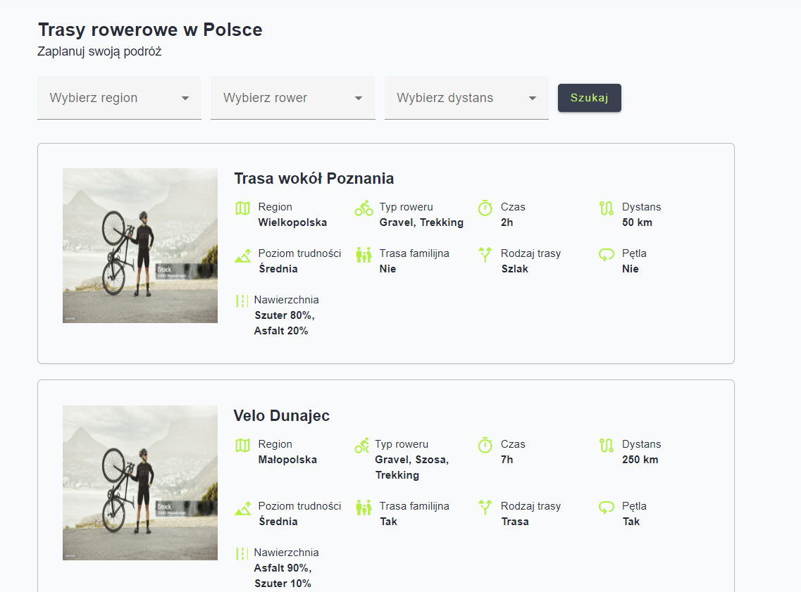
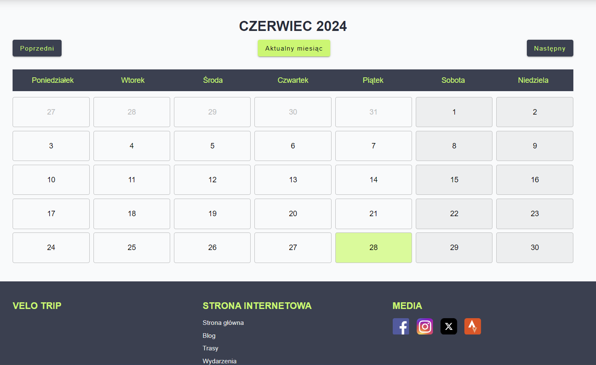
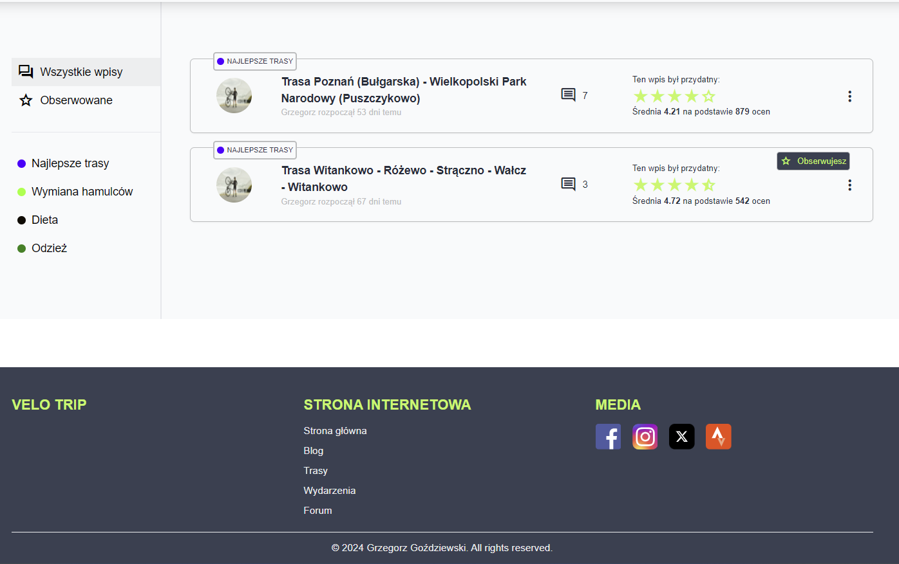

# Bicycle blog

This project was generated with [Angular CLI](https://github.com/angular/angular-cli) version 17.3.5.

## Development server

Run `ng serve` for a dev server. Navigate to `http://localhost:4200/`. The application will automatically reload if you change any of the source files.

## Build

Run `ng build` to build the project. The build artifacts will be stored in the `dist/` directory.

## My cycling passion

This project is not finished yet and all data is default !

The website will contain entries from bicycle trips, reviews and posts about bicycles.

It will be possible to view bicycle routes in detail, where the user will be able to filter them.

Additionally, there will be a calendar with various cycling events.

There will also be a forum on the website where logged-in users will be able to add topics, comment and rate whether a given entry was helpful to them.

## Project

Ultimately, the project will also have a backend written in nest.js.
The project will have user login and registration.

As an administrator, you will be able to add entries, edit routes or add events to the calendar, all from the application level.

### Technologies currently used

Angular, Angular Material, Rxjs, Ngrx, Tailwindcss, Scss, Luxon, Lodash

### Store

I use, among others, effects, router-store, component-store

## App appearance

